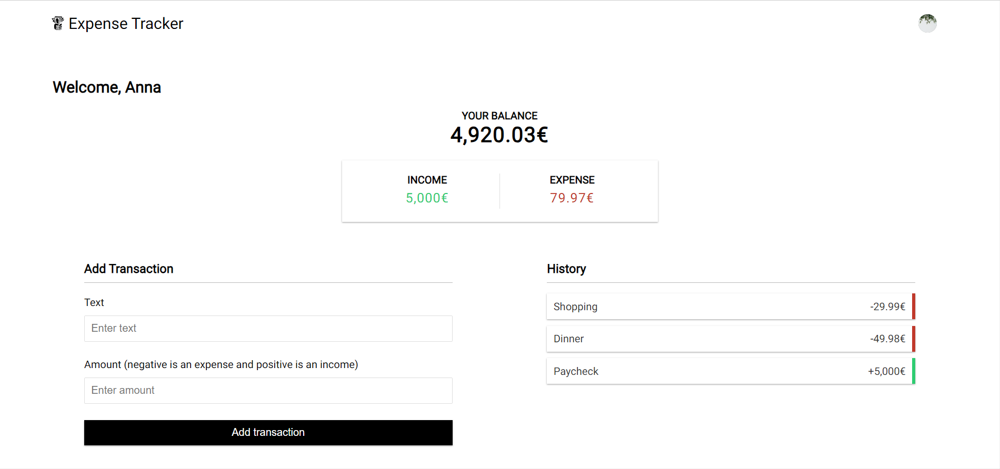

# Expense Tracker

## Description

This is an Expense Tracker app made with Next.js, Prisma, Neon & Clerk. I made it following a tutorial from [Brad Traversy](https://github.com/bradtraversy) on Youtube, you can see it [here](https://www.youtube.com/watch?v=I6DCo5RwHBE). I changed some styles and made it responsive. It is deployed with Vercel, the link is in the repository.

## App Preview

Here you have a preview of the app:

